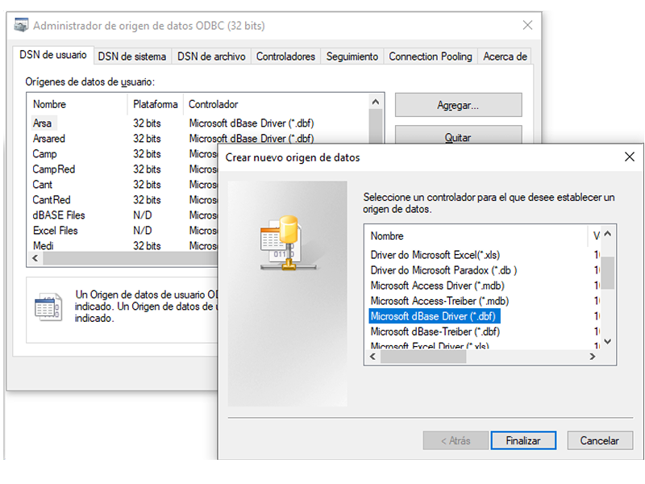

 Instalación de los datos 
------------

De acuerdo con la estructura del CAMP (<i>Sánchez & Fernández, 1998, Manual del programa CAMP. Versión 2.10</i>), los datos en formato Dbase III deben estar en:

Un directorio principal con el programa y el fichero maestro de especies <i>p.ej:</i> <b>c:/camp/</b> 

Colgando de éste los directorios con los datos de distintas áreas en las que se realizan las campañas.

En esta versión de CampR estan implementadas funciones para las siguientes zonas: 

- Demersales Norte: Galicia y el Cantábrico <i>p.ej</i>: <b>c:/camp/cant/</b>
- Banco de Porcupine <i>p.ej</i>: <b>c:/camp/Porc/</b>
- Golfo de Cádiz <i>p.ej</i>: <b>c:/camp/arsa/</b>
- Mediterraneo <i>p.ej</i>: <b>c:/camp/medi/</b>

 Orígenes de datos: DSNs de Usuario
------------

Las DSNs de usuario para los ficheros de Dbase III utilizados en el CAMP funcionan bien en 32 bits más que en 64 bits, por ello es mejor instalarlos desde el <b>odbcad32.exe</b> del directorio <b>c:/windows/system32</b>, o bien hacerlo desde el <b>c:/windows/sysWOW64</b> pero siempre buscar <b>odbcad32.exe</b>. Esto supone que <b>no se puede utilizar CampR con R a 64 bits</b>. De hecho <b>R version 3.6.3</b>:  <https://cran.r-project.org/bin/windows/base/old/3.6.3/> es la última que funciona para utilizar CampR. 
Es muy importante utilizar <b>"Microsoft dBase Driver (*.dbf)"</b> y no <del>"driver <b>do</b> Microsoft dBase .dbf"</del> u otros disponibles que no funcionan bien.

Para cada uno de estos directorios habrá que agregar un origen de datos DSN de usuario en el panel de control de herramientas administrativas de Windows: 

 

Estos DSN de usuario deben asignarse para cada una de las distintas áreas, en estos directorios estarán guardados los ficheros de cada zona:

<B> (<i>campXXX.dbf</i>, <i>lanceXXX.dbf</i>, <i>faunaXXX.dbf</i>, <i>ntallXXX.dbf</i>, <i>hidroXXX.dbf</i> y <i>edadXXX.dbf</i>) </B>

## Asignación DSN de usuario a directorios

Estos DSN deberán ser:

- Demersales: <B>Cant</B> o <B>Cnew</B> ficheros <i>*NXX.dbf</i>
- Porcupine: <B>Porc</B> o <B>Pnew</B> ficheros <i>*PXX.dbf</i>
- Golfo de Cádiz: <B>Arsa</B> ficheros <i>\*2XX.dbf</i> o <i>\*1XX.dbf</i>
- Mediterráneo: <B>Medi</B> ficheros <i>*MXX.dbf</i>

- Maestro especies: <B>Camp</B> dirigido al raíz con el especies.dbf

Cada DSN debera redirigirse al directorio con los datos respectivos y utilizar un controlador que acepte la versión Dbase III, es decir odbcad32.exe

 


Campañas y ficheros de ellas presentes en el DNS:
----------

En CampR existen algunas funciones para explorar los datos disponibles en cada dirección o DNS:

```{r echo=FALSE, message=TRUE, warning=FALSE, include=FALSE, results='hide'}
library(CampR)
```

```{r echo=FALSE, message=TRUE, warning=FALSE, paged.print=TRUE, results='markup'}
CampR::CampsDNS.camp("Porc")
```


